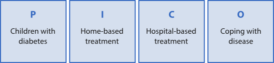
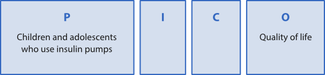

Your information requirements will be linked to the claims in your research question. By now you will have studied some texts, but perhaps you need to find more articles on the same topic? Or more texts by the same author?

## Refining  your search

One search technique involves beginning with a general search. To get better results refining your search by using various database functions. Most databases let you limit your search based on publication date, language, document type and more specialised topics. It is a good idea to use specialist subject terms from the database’s hierarchical subject index (thesaurus). Some databases also let you search by research method, context and subject area, as well as target audience. Different databases have different functions, and you should find out what the possibilities are when planning your search.

EXAMPLE: Imagine that you are planning to write about the political and religious situation before and during the Norwegian Reformation. You could go about your search as follows:

Search for “Reformation”. Thereafter restrict your search to articles concerning history and religion to exclude subjects that are less relevant to your topic. Now narrow your search by specifying the country: Norway. You could also exclude all languages except, for example, Norwegian and English. This technique will generate far fewer hits, giving you a more manageable amount of information to deal with.

## Citation searching

Look at the references in the literature you have found and see if there’s anything interesting there. Has a text you have read been cited by other authors? Use the “cited by” function in databases such as ISI Web of Knowledge and Google Scholar in order to find out who has referred to it. Could these texts also be relevant for your project?

Citation searching may reveal the extent to which other texts are influenced by the text you have found, and also which sources influenced the author. For example, search for the Norwegian book _Små steder, store spørsmål_ by Thomas Hylland Eriksen in Google Scholar. You will see that this book has been cited in 103 other publications, which indicates that the book has been influential within its field.

## Systematic search

In some fields you are expected to learn how to conduct a systematic search in order to identify high quality research results relevant to your research question. This approach is especially common in subject areas that employ evidence-based practice, such as nursing, medicine, psychology, and to some extent pedagogy. Doing a systematic search requires a structured approach to the search process, which means that the search should have a plan, be well documented and replicable (Haraldstad & Christophersen, 2008, s. 149).

### The research question

Before conducting a systematic search, you should [develop a clear research question](/en/writing/the-writing-process/from-topic-to-research-question/ "From topic to research question"). This allows a precise expression of your information needs. The PICO form can be used as a tool to help you structure your research question and to identify its most important elements. In this a way the process of conducting a search will be easier. PICO is a framework that helps you formulate a feasible research question. The acronym stands for central elements of research questions in the health field.

**P**

patient, population, participants, problem, diagnosis

**I**

intervention, action/decision, exposure

**C**

comparison, **c**ontrol or alternative intervention

**O**

outcome, result, achievement (the new information you are looking for)

Currently PICO is the most used framework within the health subjects. PICO clarifies what/who your research question deals with, it shows which action/decision you want to examine, and what results you are trying to accomplish.

EXAMPLE: the application of PICO on two research questions from the health field

Question 1: _Do children with diabetes cope better with their disease when treated by a specialist at home rather than at a hospital?_

In this example, we are interested in the effect of the decision “home-based treatment” (**I**) in contrast to the effect of “hospital-based treatment” (**C**). We are interested in finding studies that compare the effect of these two decisions. The outcome we want to measure (**O**) is how these patient groups are coping with their disease.It is not always necessary to use all four elements of the PICO-form. Sometimes the research question may not have a clear intervention (**I**) part, or it may also lack the element of comparison (**C**), or there may not be any clearly formulated outcome (**O**). Question 2 below is an illustration of a research question that contains only **P** and **O**.

Question 2: _How do diabetic children and adolescents who use insulin pumps perceive their quality of life?_

In this example we take into consideration the patient groups from question 1, but now the question focuses only on diabetic children and adolescents who are already using an insulin pump. However, the question does not specify any decision or action that we intend to measure the effect of. Therefore, this question has neither **I** nor **C**. What we want to know is how these patients are experiencing their own situation (**O**).

### Query Terms

Once you have identified the most important elements of your research question (by means of the PICO-form, for instance), you should find terms and synonyms for these elements to be used when searching for literature.

In most databases you are expected to use English query terms. Language resources such as dictionaries, Wikipedia and keyword glossaries in the databases can help you find subject terms and synonyms. For example, Medical Subject Headings (MeSH) is a well-known subject term glossary employed by many health science related databases.

To make sure that you find all relevant publications in a database, you should include synonym terms in your search. When you use the term glossaries provided by some databases, synonym terms will be included automatically in your search. Regardless, it can be useful to supplement your search with query terms taken from keyword lists provided by authors and article abstracts.

EXAMPLE: synonyms within a PICO-form.Below we illustrate a compiled PICO-form with synonym suggestions for question 2 _How do diabetic children and adolescents who use insulin pumps perceive their quality of life?_  

### Combining query terms

Most databases offer settings for saving your search history. The search history saves the query terms, keywords from texts, combinations of query terms and the number of hits retrieved. Your search process becomes clearer and more flexible when you search one term at a time and [combine the query terms with AND, OR or NOT](/en/searching/in-depth-searching/boolean-operators/ "Combining search terms") using the search history.

EXAMPLE: The search history of a systematic search

Below we illustrate the search history for the query terms that were used to conduct a search on the following question_ _How do diabetic children and adolescents who use insulin pumps perceive their quality of life?__ The search history is taken from the Medline-Ovid database from 1996 up to present day. The search date was 04.04.14.

**Searches**

**Results**

1

exp Diabetes Mellitus, Type 1/

35330

2

(insulin adj dependent).tw.

10687

3

1 or 2

41759

4

(youth or teenager\* or adolescent\* or child\*).tw.

591106

5

exp Adolescent/

821820

6

exp Child/

721155

7

4 or 5 or 6

1307311

8

exp «Quality of Life»/

98652

9

(quality adj2 life).tw.

118348

10

(life adj quality).tw.

2843

11

(well adj being).tw.

28740

12

Wellness.tw.

3183

13

8 or 9 or 10 or 11 or 12

174420

14

exp Insulin Infusion Systems/

1794

15

(infusion adj pump\*).tw.

1266

16

exp Infusion Pumps/

6397

17

14 or 15 or 16

7034

18

3 and 7 and 13 and 17

100

Explanation for the search history:

The backslash (/) indicates that the query terms are taken from the terms glossary of Medical Subject Headlines.

_Exp:_ indicates that subordinate terms are included in MeSH.

_Tw_: indicates that the query is based on a text term taken from an article’s title or summary (not from MeSH).

_Adj:_ indicates that the search terms will be composed as a phrase, that is right next to each other in the specified order.

### Reviewing search results

By reviewing your search results, you may get new insights that can lead you to reformulate your initial research question. Similarly, a very long list of a search hits probably indicates a research question that is too general, and thus needs to be narrowed down. In this case, you will need to readjust your search strategy to handle the reformulated research question.

In the example above, the review of the research shows that there is a huge difference in how children and adolescents experience living with an insulin pump. In this case, you might need to limit your study to either children or adolescents. Ultimately, reviewing the search hits could lead you to reformulating the research question, perhaps to _why is the use of insulin pumps experienced differently by children and adolescents_.

Most databases let you filter your search results. For example, the hits can be narrowed down according to:

- Year of publication
- Type of publication
- Language
- Research methodology
- Accessibility (for example, full text or not).

However, be aware that you might lose important documents by filtering.

In the end, you will need to [evaluate the quality and relevance](/en/sources-and-references/source-evaluation/ "Source evaluation") of each individual article in light of your research question.

### Documenting your search

In some fields, after completing a systematic search, you have to describe the search process in detail so that your readers can replicate and evaluate the quality of your search. Document the following:

- Which databases you used
- Which query terms you have used in the different databases, and how you have combined these terms with AND/OR/NOT
- Have you used a term glossary?
- Have you used other functions provided by the databases?
- The date of your search

TIPS: after you are done searching, save the search so that you can reuse it later. The search history is the best documentation of your search.

## References

Haraldstad, A.-M. B. & Christophersen, E. (2008) Litteratursøk og personlige referansedatabaser. I: Laake, P., Olsen, B. R. & Benestad, H. B. red. _Forskning i medisin og biofag._ 2. utg. Oslo, Gyldendal akademisk, s.147-186.
