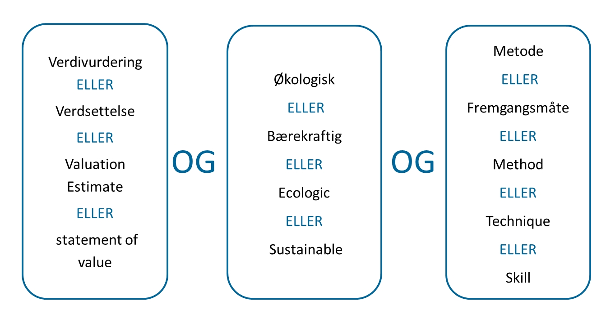

# Searching techniques

## Finding good search terms

In order to find good search terms, use your research question as a starting point and identify key terms, including their synonyms.

**Consider the following:**

- Use subject-related terminology. Many databases have a built-in thesaurus that includes recognized terms and their associated synonyms.
- Note that terms which are useful in one database may be less useful in another.
- Language: Most international databases require that you search in English. Even though [Oria](oria.no) provides search-results in both Norwegian and English, you might miss many relevant documents if you only choose Norwegian search terms. English language terms can be found in textbooks, articles and dictionaries. Read abstracts and look for the author’s own terminology.
- **Be creative:** Find as many synonyms as possible for the concepts you are interested in.
- Do not use too many different elements in a search; two or three are normally enough.
- Make a chart and designate a column for every term that makes up your research question, and add synonyms for each term in its respective column (see example further below).

### Free text searching

Free text searching, or searching for words in the textbox, is the most common approach to begin with. In this case, you search for words from the title, the abstract, subject terms and keywords. Since a phenomenon can often be described with different terms, it is important to include synonyms.

### Limiting the search

A long list of hits may be limited according to your needs. Most databases offer limitations based on year of publication, language, subject area and document type. Keep in mind that limiting the search results might cause you to miss some important information.

## Searching for subject headings

To search for "subject headings" means to search in the controlled vocabulary of a database. In other words, some databases offer a set of standardized subject terms to describe the content of a document. An advantage with this method of searching is that the database automatically includes synonyms in the search.

## Combine search terms

Once you have formulated your research question and identified the relevant search terms, you need to think about how to combine them. Most databases allow you to combine search terms in various ways by means of the Boolean operators AND, OR and NOT.

### Combining search terms using AND

When you combine your query terms by using AND, the resulting hits will contain documents that deal with both terms. The AND operator aims at focusing the search and narrowing down the number of hits.

When you search for **decubitus AND prevention**, the resulting hits will contain only documents that deal with both decubitus and prevention as shown in the diagram below.

<ClientOnly>
  <Venn 
    v-bind:sets="[
        {sets: ['decubitus'], size: 12}, 
        {sets: ['prevention'], size: 12},
        {sets: ['decubitus','prevention'], size: 3}
    ]" 
    text="Hits when doing AND search"
    type="and" />
</ClientOnly>

### Combining search terms using OR

When you choose to join two terms with the OR operator, you get a search result that contain either one of the terms, or both. Combining search terms with OR thus generates an extended search result with a larger number of hits. The OR operator is usually employed to cover alternatives or synonyms of a query term. For example, the search for **decubitus OR bedsore**, will give a hit that contains either decubitus or bedsore, or decubitus and bedsore as shown in the diagram below.

<ClientOnly>
  <Venn 
    v-bind:sets="[
        {sets: ['decubitus'], size: 12}, 
        {sets: ['bedsore'], size: 12},
        {sets: ['decubitus','bedsore'], size: 3}
    ]" 
    text="Hits when doing a OR search"
    type="or" />
</ClientOnly>

### Combining search terms using NOT

When you combine your query terms with the operator NOT, your search result will consist of only one of the terms, and the other term will be eliminated from the search. Since the use of NOT eliminates a large number of hits, it should be used with caution. For example, when you search for **decubitus NOT prevention**, your search results will contain only instances of decubitus, and all documents that deal with prevention will be filtered out from the search.

<ClientOnly>
  <Venn 
    v-bind:sets="[
        {sets: ['decubitus'], size: 12}, 
        {sets: ['prevention'], size: 12},
        {sets: ['decubitus','prevention'], size: 3}
    ]" 
    text="Hits when doing a NOT search"
    type="not" />
</ClientOnly>

## Using a search table

The table below has three columns, one for each of the three components of the research question. First, the synonymous keywords in each column are combined with OR, then, all the matches in the three columns are combined with AND.

This procedure can be applied to the vast majority of projects.

Example: Research question: "Is it profitable for businesses to market themselves as sustainable?"

### Truncation

Truncation is a technique often used to increase the number of hits. Truncation means to search for the trunk of a word in order to include both singular and plural forms of a word and also its different variants. As a rule, truncation is marked by an asterisk (\*). For example, searching for minorit\* will give hits on minorities, minority, minoritet, minoriteter and so forth.
