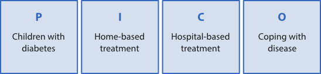
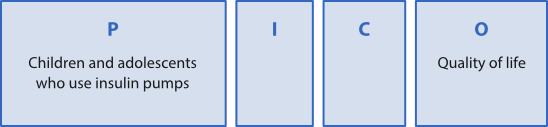

## Research question

Before conducting a systematic search, you need to [develop a clear research question](/en/writing/the-writing-process/from-topic-to-research-question/ "From topic to research question"). This allows a precise expression of your information needs and makes searching easier.

The PICO form can be used to structure your research question and identify its most important elements.  The acronym stands for central elements of a research question in the medical sciences.

**P**

patient, population, participants, problem, diagnosis

**I**

intervention, action/decision, exposure

**C**

comparison, **c**ontrol or alternative intervention

**O**

outcome, result, achievement (the new information you are looking for)

Currently PICO is the most used framework within medicine and healthcare. PICO clarifies what/who your research question deals with, it shows which intervention you want to examine, and which results you are trying to accomplish.

EXAMPLE: the application of PICO on two research questions from the health field

Question 1: _Do children with diabetes cope better with their disease when treated by a specialist at home rather than at a hospital?_

In this example, we are interested in the effect of the decision “home-based treatment” (**I**) in contrast to the effect of “hospital-based treatment” (**C**). We are interested in finding studies that compare the effects of these two decisions. The outcome we want to measure (**O**) is how these patient groups are coping with their disease. It is not always necessary to use all four elements of the PICO-form. Sometimes the research question may not have a clear intervention (**I**) part, or it may also lack the element of comparison (**C**), or there may not be any clearly formulated outcome (**O**). Question 2 below is an illustration of a research question that contains only **P** and **O**.

Question 2: _How do diabetic children and adolescents who use insulin pumps perceive their quality of life?_

In this example we take into consideration the patient groups from question 1, but now the question focuses only on diabetic children and adolescents who are already using an insulin pump. However, the question does not specify any decision or action that we intend to measure the effect of. Therefore, this question has neither **I** nor **C**. What we want to know is how these patients are experiencing their own situation (**O**).

It is not always appropriate to fill in all the four elements of the PICO-form. Sometimes there is no clear **I (Intervention)** available, other times **C (Comparison)** might be missing, and some other times there is no clearly formulated **O (Outcome)**. Question number 2 below is an example of an occasion in which we only have a clearly defined **P** and **O**.

**Question 2:** How do children and adolescents who use insulin pumps experience life quality?

**P:** Children and adolescents who use insulin pumps

**I:**

**C:**

**O:** Life quality

In this example, the question is pointed at the same group of patients as in question 1, the difference being that in question 2 we have narrowed down to the children and adolescents who already use insulin pumps. There are no specific actions that we are interested in investigating the effect of, hence nothing has been noted under **I** or **C**. What we want to gain more knowledge about **(O)** is the patient’s own experience of his/her situation.

## Search terms

When you have outlined the most important parts of the research question with the help of, for example, the PICO form, you must work further to find precise subject-related terms and their synonyms that can be used in the search for relevant literature.

Medical Subject Headings (MeSH) is the most well-known subject-related wordlist within health-related subjects. It is used in several health-related databases.

To make sure to find all relevant articles, one should include synonyms for each keyword in the searching. If you chose to search via a subject-related wordlist in a database (for example MeSH), it will automatically include some of the synonyms in the search. Nevertheless, it is useful to supplement the search with words picked out from the author's keywords or from the article’s abstract.

EXAMPLE: PICO-form with synonym suggestionsBelow you can see a filled out PICO-form with synonym suggestions connected to question 2:

How do children and adolescents who use insulin pumps experience life quality?

**P:** Children and adolescents who use insulin pumps. **Search terms:** Diabetes mellitus, Type 1 insulin dependent diabetes, Youth, Teenager, Adolescent, Child, Insulin infusion systems, Infusion pumps

**I:**

**C:**

**O:** Life quality. **Keywords:** quality of life, wellness, well being

## Combination of search terms:

All major article databases give you access to a search history. The search history displays which subject-related terms you have looked up, how they are combined, and how many hits each search has resulted in. The searching process becomes flexible and clear if you choose to search one word at a time and then combine the searches with AND, OR or NOT in the search history.

EXAMPLE: Systematic search presented via search historyHere you can see the search history of a search based on Question 2:

How do children and adolescents who use insulin pumps experience life quality?

The search has been conducted in the Medline-Ovid database 1996 and up until today. Date of searching: 04.04.2014

Searches

Results

1

exp Diabetes Mellitus, Type 1/

35330

2

(insulin adj dependent).tw.

10687

3

1 or 2

41759

4

(youth or teenager\* or adolescent\* or child\*).tw.

591106

5

exp Adolescent/

821820

6

exp Child/

721155

7

4 or 5 or 6

1307311

8

exp «Quality of Life»/

98652

9

(quality adj2 life).tw.

118348

10

(life adj quality).tw.

2843

11

(well adj being).tw.

28740

12

Wellness.tw.

3183

13

8 or 9 or 10 or 11 or 12

174420

14

exp Insulin Infusion Systems/

1794

15

(infusion adj pump\*).tw.

1266

16

exp Infusion Pumps/

6397

17

14 or 15 or 16

7034

18

3 and 7 and 13 and 17

100

## Explanation of Search History:

- **/ :** the slash indicates that the term is taken from the subject-related wordlist, Medical Subject Headings (MeSH)
- **exp:** Explode indicates that subordinate terms have been included
- **tw:** indicates that this search is based on a term taken from the title or the abstract of the article (not from MeSH)
- **adj:** these search terms should act as a phrase, that is, one after the other in a given order

## Review search results

A review of the search results may occasionally provide new insight that can cause you to reconsider and perhaps alter your original research question. Also, a very long hit list make evident that the research question is too broad and that it needs to be narrowed down and made more precise. In such cases the searching strategy need to be set up from scratch and the search will be adjusted according to the new research question. In the example above, reviewing the list of results showed that there is a huge difference in how children and adolescents experience living with an insulin pump. Perhaps, it would be a good idea to narrow the research question so that it concerns only children or adolescents. This review might eventually lead to you to focus the research question on why living with an insulin pump is experienced so differently for the two age groups.

Some databases offer an opportunity to limit/narrow down a hit list. You can for example narrow it down based on:

- Year
- Type of publication (Research article or Research journals)
- Language
- Research method
- Availability (for example full text)

Keep in mind that limiting the search results might cause you to miss some important information.

Finally, you must measure each article’s quality and relevance in relation to your research question.

## Documenting the search

In certain subjects, after completing the systematic search, you need to describe the actual search process thoroughly so that the reader is able to evaluate the quality of the search you have done and possibly repeat the same search later. You should say something about:

- Which databases you have chosen to search in
- Which search terms you have used in the various databases and how they have been combined (AND/OR/NOT)
- Have you used the controlled subject terms of the database?
- Have you used other search facilities in the database?
- The date of when the search was composed
- **Tip:** When you are ready with a search in a database, it is a good idea to save the search history so that you can retrieve it later. The search history is the best way to document your search. Remember to note which databases you have searched in.

## Further Reading:

Haraldstad, A.-M.B. og Christophersen, E. (2008) Litteratursøk og personlige referansedatabaser. I: Laake, P., Olsen, B.R. og Benestad, H.B. red. _Forskning i medisin og biofag._ 2. utg. Oslo, Gyldendal akademisk, s.147-186.

See also PhD on track’s page on [systematic review searching](http://www.phdontrack.net/review-and-discover/systematic-review-searching/)
