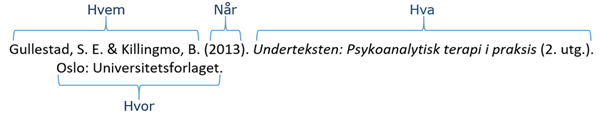

# APA 6th

**Eksempel 1**

APA står for American Psychological Association. Foreningen har utviklet en referansestil som er en typisk forfatter-årstallstil. Den er vanlig innenfor blant annet psykologi, økonomi, pedagogikk, helsefag og realfag. Det som presenteres her er en  norsk bearbeiding av:

American Psychological Association. (2010). _Publication manual of the American Psychological Association_ (6. utg.). Washington, D.C.: Forfatter.

Anbefalingene er resultat av et [nasjonalt samarbeid](https://www.unit.no/norsk-apa-referansestil/). Skriver du på engelsk, eller har fått krav om å bruke en engelsk manual,  oppfordrer vi deg til å bruke den [originale manualen](http://ask.bibsys.no/ask/action/show?pid=092422497&kid=biblio) og/eller [guiden fra Purdue University](https://owl.english.purdue.edu/owl/resource/560/01/).

## Referanselisten

Med unntak for enkelte offentlige dokumenter, består en referanse i APA 6th grovt sett av fire deler i fast rekkefølge: Opphavspersoner, publiseringsdato, dokumentets tittel og publikasjonsinformasjon. Disse gir svar på spørsmålene om _hvem_ som står bak kilden, _når_ den er publisert, _hva_ den heter og _hvor_ den kan finnes.

Formatet varierer etter dokumenttype. Selvstendige utgivelser som bøker, rapporter, filmer, TV-serier og kunstverk skal ha tittel i kursiv, mens dokumenter som inngår i et større hele, som kapitler, tidsskriftartikler og nettsider, ikke skal ha det.

Bøker og rapporter kan noen ganger ha en parentes like etter tittelen som oppgir utgave, bind eller sidetall (for enkeltkapitler) eller serienummer for rapporter og retningslinjer. Mer uvanlige referanser, som bilder, brosjyrer eller LP-plater, kan ha en hakeparentes samme sted som angir verkets format.

For selvstendige dokumenter vil referansens _hvor_ være henholdsvis utgivelsessted og utgiver for fysiske utgivelser, og DOI-nummer eller URL for elektroniske publikasjoner. For dokumenter som inngår i en større utgivelse, som et tidsskrift eller en redigert bok, vil denne inngå i referansens _hvor_. Variasjonen her er stor, og mer inngående beskrevet i eksempelsamlingen under.

- Referanselisten skal ordnes alfabetisk på forfatternes etternavn.
- Ved flere medforfattere skal listen alfabetiseres ut fra førsteforfatteren.
- Har en forfatter skrevet flere verk, skal de ordnes kronologisk med eldste årstall først.
- Har en forfatter skrevet flere verk i samme år brukes a, b, c, etter årstallet for å skille arbeidene.
- Ved referanser som skrives over flere linjer skal alle linjene ha innrykk unntatt den første.
- Om verket har mer enn syv forfattere, listes de seks første, fulgt av en ellipse (...) og sisteforfatteren.

::: details Bok

|I teksten|I referanselisten|
|---------|-----------------|
|(Forfatter, årstall, sidetall)|Forfatter, A. A. & Forfatter, B. B. (Årstall). _Tittel_ (utg.). Utgivelsessted: Forlag. \*Utgaveopplysninger skal ikke føres opp ved førsteutgaver.|

::: tip Eksempel
Retterstøl, Ekeberg og Mehlum (2002, s. 54) hevder at …

(Gullestad & Killingmo, 2013, s. 35)

Retterstøl, N., Ekeberg, Ø. & Mehlum, L. (2002). _Selvmord: Et personlig og samfunnsmessig problem_. Oslo: Gyldendal.

Gullestad, S. E. & Killingmo, B. (2013). _Underteksten: Psykoanalytisk terapi i praksis_ (2. utg.). Oslo: Universitetsforlaget.
:::

::: details E-Bok

**Kilden i teksten**

(Forfatter, årstall, sidetall)

**Kilden i refereranselisten**

Forfatter, A. A. & Forfatter, B. B. (Årstall). _Tittel_ \[Ebok-leser, om boken har et spesielt format\]. https://doi.org/10.xxx

### Merknarder

Piketty, T. (2014). _Capital in the twenty-first century_ \[Kindle\]. Cambridge, MA: Belknap Press. Hentet fra https://www.amazon.com \*Kindle har ikke sidetall, men har egne «location»-nummer. Disse vil ikke fungere på andre enheter, så henvis heller til kapittel og avsnitt.

Dersom boken har [DOI-nummer](/kildebruk-og-referanser/kildevurdering/kvalitative-vurderinger/nettadresser-url/#DOI), brukes dette. APA-stilen tillater flere måter å oppgi DOI, men [anbefaler lenkeformatet https://doi.org/10.xxx](http://blog.apastyle.org/apastyle/2017/03/doi-display-guidelines-update-march-2017.html) – uten «Hentet fra» foran. Dersom DOI mangler, brukes nettadresse: Hentet fra http://URL. Om nettadressen ikke inneholder navn på forlag, bør sted og utgiver oppgis som for trykte bøker.

::: tip Eksempler
Watkins (2012) hevder at ... (s. 54).

Watkins, M. (2012). _Discipline and learn: Bodies, pedagogy and writing._ https://doi.org/10.1007/978-94-6091-699-1

... som hevdes av Piketty (2014, A global tax on capital, avsn. 3)
:::

::: details Kapittel i redigert bok

::: tip Kilden i teksten
(Forfatter, årstall, sidetall)

**Kilden i referanselisten**

Forfatter, A. A. (Årstall). Kapitteltittel. I A. Redaktør & B. Redaktør (Red.), _Tittel_ (s. xxx–xxx). Utgivelsessted: Forlag.

::: warning Eksempler

En større undersøkelse i Australia viste at … (Trickett, 2001, s. 9646).

Trickett, E. J. (2001). Mental Health: Community Interventions. I N. J. Smelser & P. B. Baltes (Red.), _International encyclopedia of the social & the behavioral sciences_ (s. 9645–9648). Amsterdam: Elsevier.
:::

::: details Avhandling - doktor/master

::: tip Kilden i teksten
(Forfatter, årstall, sidetall)

**Kilden i refereranselisten**

Trykt oppgave: Forfatter, A. A. (Årstall). _Tittel_ (Masteroppgave). Institusjon, Sted.

Avhandling på nett: Forfatter, A. A. (Årstall). _Tittel_ (Doktoravhandling, institusjon). Hentet fra http://URL

::: details Eksempler
Kyrkjebø (2001) viser i sin doktoravhandling forskjellen mellom ... (s. 39)

Kyrkjebø, R. (2001). _Heimskringla I etter Jofraskinna: Karakteristikk av tekstvitna samt tekstkritisk utgåve av Jens Nilssøns avskrift i AM 37 folio_ (Doktoravhandling). Universitetet i Bergen.\*Når stedsnavn  er en del av institusjonens navn, gjentas ikke dette.

... (Våpenstad, 2011, s. 59).

Våpenstad, E.V. (2011). _Det tempererte nærvær: En teoretisk undersøkelse av psykoterapeutens subjektivitet i psykoanalyse og psykoanalytisk psykoterapi_ (Doktoravhandling). Hentet fra https://bora.uib.no/handle/1956/4788\*Referanser til avhandlinger som er publisert i institusjonsarkiv (som Bora) trenger ikke ha med institusjonsnavnet. Se kap. 7.05 i [manualen](http://ask.bibsys.no/ask/action/show?pid=092422497&kid=biblio).
:::

::: details Lover

**Kilde i teksten**

(Lovens kortnavn, årstall, paragraf)

**Kilde i referanselisten**

Lovens kortnavn. (Årstall). Lang tittel (datokode). Hentet fra https://...

### Merknad

APA bruker «[The Bluebook](https://www.legalbluebook.com/)» som kilde til sin stil for lover og andre rettslige kilder, og manualen forholder seg til lovgivning i USA. Rettssystemene i verden er imidlertid så ulike at det er vanskelig å lage en felles stil for lover og forskrifter. Eksemplene her er tilpasset APA-formatet slik det brukes for andre kilder, med intensjon om å gjøre det enkelt både å referere og å finne tilbake til kilden. Juridiske fag kan ha andre krav.

I Norge henviser vi til «originalloven» som konsolideres ved endringer. Det er den konsoliderte versjonen av lover som står i lovsamlingen, og man bruker orginaldatoen når man refererer til den. Man kan også vise til dato for endringer hvis man diskuterer selve endringen, men da refererer man til endringens offisielle tittel.

Lenke er ikke obligatorisk, men kan være til hjelp for lesere av elektroniske dokumenter. Bruk i så fall permanent lenke, som kan finnes under deleikonet på Lovdata.

::: warning Eksempel 
I folketrygdloven (1997, § 14-4) står det om svangerskapspenger at ...

Folketrygdloven. (1997). Lov om folketrygd (LOV-1997-02-28-19). Hentet fra [https://lovdata.no/lov/1997-02-28-19](https://lovdata.no/lov/1997-02-28-19)

Med endringslov til folketrygdloven (2018) endres finansieringen ...

Endringslov til folketrygdloven. (2018). Lov om endring i folketrygdloven (LOV-2018-06-22-55). Hentet fra [https://lovdata.no/lov/2018-06-22-55](https://lovdata.no/lov/2018-06-22-55)
:::

## Henvisninger i teksten

### Forfatternavn

Bruker du forfatternavnet i setningen, skriv årstall i parentes etter forfatteren.

> _Barrow (1974) fant…_

Hvis forfatterens navn ikke står i setningen, skriv i en parentes forfatterens navn og årstall.

> _... (Barrow, 1974)._

Hvis du nevner tittelen til en bok, eller rapport i teksten, skriver du tittelen i kursiv. Kilder som føres i kursiv i referanselisten skal føres i kursiv også dersom de nevnes i teksten. Dersom tidsskriftartikler eller bokkapitler nevnes i teksten skal de ikke kursiveres, men markeres med hermetegn (gjelder alle kilder som ikke skal skrives i kursiv i referanselisten).

> _I_ Latter og dialog _skriver_ _M. Bakhtin (2003, s. 36) at…_

### Antall forfattere

Hvis en kilde har to forfattere må du skrive begge navnene _hver gang_ referansen forekommer i teksten.

> _... (Dewdney & Ross 1994). _

Dersom kilden har 3-5 forfattere, skal alle oppgis ved _første_ henvisning. Senere oppgir du kun førsteforfatter etterfulgt av **et al**. **Merk!** Forkortinga **ibid** brukes **ikke** i APA6th.

Dersom kilden har seks eller flere forfattere, skal du _kun_ oppgi førsteforfatter etterfulgt av **et al**.

Tips: Se tabell 6.1 i [manualen](http://ask.bibsys.no/ask/action/show?pid=092422497&kid=biblio).

> _Kvale et al. (2009, s. 100) peker på at…_

Dersom man har flere forfattere med samme etternavn skal initialer brukes.

> _R. D. Luce (1959) og P. A. Luce (1986) fant…_

Tips: Se tabell 6.1 i [manualen](http://ask.bibsys.no/ask/action/show?pid=092422497&kid=biblio)!

### Årstall

Hvis en forfatter har publisert flere arbeider samme år skilles de med at man tilføyer a, b, c osv.

> _… (Faingold, 1996c)._

### Sidetall

APA krever sidetall (eller avsnittnummer) ved direkte sitat, og oppfordrer også til å oppgi sidetall ved parafraser av eller henvisning til tanker formidlet i et verk, særlig i lange og kompliserte tekster. Ved å vise til sidetall, gjør du det lettere for den som leser å finne fram til riktig sted. Det varierer mellom fagtradisjoner i hvor konsekvent man er til å vise til sidetall. I noen fag er det mest vanlig kun på direkte sitat. Det er vanligvis mindre hensiktsmessig å oppgi sidetall når man henviser til eller oppsummerer et helt verk, eller når man viser til hovedfunnet i en kortere vitenskapelig artikkel.

Sidehenvisninger kan oppgis på ulike måter:

> _Ifølge Kalleberg (2016) bør forskningsmiljøene «forsterke sin innsats for å fremme god henvisningsskikk og forebygge plagiering» (s. 90)._

> _«Forskningsmiljøene bør forsterke sin innsats for å fremme god henvisningsskikk og forebygge plagiering» (Kalleberg, 2016, s. 90)._

> _«Forskningsmiljøene bør forsterke sin innsats for å fremme god henvisningsskikk og forebygge plagiering», hevder Kalleberg (2016, s. 90)._

### Forkortelser

Dersom et dokument er utgitt av en offentlig instans, organisasjon eller forening skrives hele navnet i alle siteringer. Forkortelse kan brukes dersom den er lett gjenkjennelig. Ved første gangs sitering skriver du hele navnet og forkortelsen i hakeparentes.

> _(Norsk rikskringkasting \[NRK\], 1999)_

Ved annen gangs sitering og senere:

> _(NRK, 1999)_

Tips: Se tabell 6.1 i [manualen](http://ask.bibsys.no/ask/action/show?pid=092422497&kid=biblio)!

### Sekundærhenvisning

I APA-stilen brukes begrepet sekundærkilder om en kilde man har lest, men som viser til et annet verk. Det man har lest er en forfatters sitering eller gjenfortelling av et faglig innhold som kommer fra en annen. Det beste er å bruke originalkilden i størst mulig grad. Om du likevel bruker sekundærkilden, så vær oppmerksom på at det bare er denne som skal oppgis i referanselisten på slutten av oppgaven. Originalkilden skal oppgis i henvisningen på følgende måter:

> _Winnicott referert i Solomon (2001, s. 50) viser til..._

Det blir det samme om du setter hele referansen inne i parentesen:

> _... ifølge ham (Winnicott, referert i Solomon, 2001, s. 50)._

Solomon er her teksten som blir lest, og oppført i referanselisten. Winnicott er originalkilden.

### Sitat

Et sitat fra en annen forsker/forfatter må være eksakt gjengitt og inneholde kildehenvisning. Sitater som er under 40 ord integreres i teksten og fremheves med hermetegn.

> _"The similarity between demonstratives and articles, both synchronically and diachronically, is not coincidental but due to grammaticalization processes whereby old forms acquire new functions" (Faingold, 2003, s. 53)._
> 
> _Faingold (2003) hevdet at "The similarity between demonstratives and articles, both synchronically and diachronically, is not coincidental but due to grammaticalization processes whereby old forms acquire new functions" (s. 53)._

Sitater som er lengre enn 40 ord skal skrives i et eget avsnitt med innrykk. Her brukes det ikke hermetegn, og punktum settes før parentes.

### Indirekte sitat

Indirekte sitat eller parafrasering er å gjengi en annen forfatter med egne ord. Pass på at du ikke fordreier meningsinnholdet i omskrivingen. Når du viser til en avgrenset del av en kilde bør henvisningen inneholde sidetall. Dette gjør leseren i stand til å finne raskt frem i kilden og å kontrollere fakta. Om du bruker dine egne oversettelser i teksten, regner APA-stilen disse som parafraser.

> _Kloster (2003, s. 10) skriver i sin hovedfagsoppgave at singellivet som eksisterer i det senmoderne samfunnet er en konsekvens av demokratisering av privatsfæren._

### Nettsider/elektroniske dokumenter

- Nettsider med forfatter refereres til med forfatternavn og årstall.
- Nettsider uten forfatter hvor artikkelen er en del av et større nettsted oppgis navnet til nettstedet/organisasjonen som forfatter.
- Dersom nettsiden er ikke har oppgitt forfatter eller ansvarlig organisasjon, skal referansen i teksten oppgi noen ord av tittelen på siden for å vise leseren hvor den kan finnes i litteraturlisten.
- Når man omtaler et helt nettsted, og ikke et spesifikt dokument på nettsiden, oppgis hele adressen til siden i teksten, men man trenger ikke ta med denne i referanselista:

> _På NAVs nettsider kan arbeidssøkere finne jobbannonser, sende inn meldekort og registrere CV ([http://www.nav.no](http://www.nav.no))._

Se forøvrig APAs [egne nettsider](http://blog.apastyle.org/apastyle/2010/11/how-to-cite-something-you-found-on-a-website-in-apa-style.html) for å få tips til hvordan du siterer ulike typer informasjon du har funnet på Internett.

### Lover

I teksten brukes lovens kortnavn, (eventuelt paragrafnummer) og årstall.

> _I Helsepersonelloven § 6 (1999) blir det slått fast at …._

### Forskrifter

I teksten brukes forskriftens kortnavn og årstall.

> _Forskrift om oppfølging av sykemeldte (2007) viser til …_

### Stortingsmeldinger

Departementet er forfatter, og skal oppgis som del av referansen.

> _Dette temaet er nærmere belyst i St.meld. nr. 8 (Sosial- og helsedepartementet, 1998)._

### Norges offentlige utredninger (NOU)

Departementet er utgiver, og skal oppgis som del av referansen. Utredningen kan også omtales med navn/nummer.
