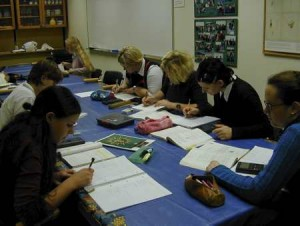

Lengre tekster, som masteroppgaver, krever at du skriver jevnt og trutt. For å holde prosessen i gang, er er det klokt å la andre lese utkast underveis. Slik vil du også finne ut hvordan oppgaven din kommuniserer med en leser. Som medlem av en skrivegruppe kan du legge fram utkast, gi og få respons og finne støtte i et fellesskap av medstudenter. Skrivegruppen erstatter ikke veilederen, men er et supplement. En ideell skrivegruppe er en gruppe studenter i samme fag som er på ulike stadier i oppgaven. Er du allerede med i en kollokvie eller [lesegruppe](?p=2219) som fungerer godt, bruk den!

Stipendiatene Kajsa Parding og Sandhya Tiwari ved UiB har hatt mye glede av sin skrivegruppe i sluttfasen av doktorgradsarbeidet:

@[youtube](pbH-PqsYxK8)

## Hvordan gi og ta imot tilbakemelding i skrivegrupper?

Det er meningen at du skal gi innspill til andres ideer og få tilbakemeldinger på egne. Noen ganger kan det være vel så lærerikt å kommentere som å få respons. Grunnen er at du lærer mye om å skrive ved å analysere andres tekster, og sette ord på det du ser. Tekstene kan være mer eller mindre ferdige. Før du leverer en tekst til skrivegruppa:

- Informer leserne om hvilken type tekst det er, og hvor den skal inn i oppgaven.
- Gi melding på forhånd om det er spesielle ting i teksten du ønsker tilbakemelding på.

Når du leser og gir tilbakemelding, pass på:

- Les teksten på forhånd.
- Forbered og formuler kommentarene dine skriftlig.
- Begynn med det positive. Det fins alltid noe godt i en tekst som forfatteren kan videreutvikle.
- Forklar hva du synes forfatteren har lykkes med, og hvorfor det fungerer. Uspesifisert ros er ikke til noen nytte.
- Spør om det som er uklart. Foreslå alternativer i stedet for å bare kritisere.
- Husk at det å levere fra seg en tekst til andre kan være et stort steg å ta for medstudenten din, så les godt og grundig, og gi konstruktive kommentarer.

God tilbakemelding er konkret, konstruktiv og kjærlig.

Når du mottar tilbakemelding:

- Vær åpen for kommentarene de andre medlemmene av skrivegruppa gir. Husk at de har lagt arbeid i å forstå teksten din.
- Lytt, og skriv ned kommentarene i stedet for å argumentere eller forsvare deg. Selv om du ikke er enig i kommentarene, gjenspeiler de en leseropplevelse som du kan ta hensyn til i det videre arbeidet. Det nye utkastet blir ditt svar.
- En tekst kan alltid bli bedre. Når teksten din blir lest av andre, får du et større perspektiv på muligheter i teksten din.
- Det er du som bestemmer over din tekst. Ta hensyn til kommentarene du mener er relevante, og overse resten.

Avtal å møtes jevnlig og møt alltid forberedt. Som medlem av en skrivegruppe får du en uvurderlig drahjelp i oppgavearbeidet. Og når innlevering står for døra, vet du hvor du kan henvende deg for å få en siste gjennomlesning.

## Verktøy for gruppearbeidet

 

_Skrivegrupper, Ill.foto: UiB_

Om du i deltar i et gruppearbeid der dere skal levere en felles tekst finnes det flere [verktøy for samskriving](http://en.wikipedia.org/wiki/Collaborative_real-time_editor). Det  er ikke alltid like hensiktsmessig å bruke Word og e-post eller et læringsstøttesystem. Et verktøy som dere kan bruke i stedet er Docs & Spreadsheets i Google Drive. Dette er en gratis nettbasert tekstredigerer med lav brukerterskel.

Dere bestemmer selv hvem som er med i skrivegruppen, og innsyn stenges for andre. På en smidig måte redigeres teksten med flere samtidige skribenter koblet til. Programmet holder orden på innleggene, og skrivingen kan pågå i direkte, virtuell kommunikasjon med hele gruppen. Teksten kan lagres i doc, PDF, RTF eller ODF format eller publiseres som blogg. Vil du vite mer se [Wikipedias artikkel](http://en.wikipedia.org/wiki/Google_Drive "Google Drive").

## Hold skriveprosessen i gang

For å holde oversikt over skrivearbeidet ditt kan det være en god ide å føre en logg, eller en skrivedagbok, om hva du har gjort og hva du skal gjøre. Du kan også opprette en blogg for å få og gi innspill underveis i skriveprosessen. Bloggen kan brukes på mange måter. Du kan bruke den alene eller sammen med andre.

I utgangspunktet er bloggen åpen for alle. Alle kan lese bloggen din og legge inn kommentarer på den. Du velger selv om andres kommentarer skal publiseres eller ikke. Skrivesjangeren er uhøytidelig, og terskelen for å komme i gang med skrivingen er lav. Dette så klart forutsatt at du er vant med å bruke sosiale medier.

Noen blogger har en personlig stil som grenser mot dagbokform, andre er ment som faglige diskusjonsfora. De fleste blogger publiseres med egne bloggverktøy som finnes fritt tilgjengelige på internett, for eksempel

- blogg.no
- blogger.com
- www.wordpress.com

**Videre lesing**:  
Dysthe, O. og Lied, L.I. (1999) _Skrivegrupper._ Læring ved universitetet, nr.  2/99. Bergen: Universitetet i Bergen.  
Vaage S. (2001). Perspektivtaking, rekonstruksjon av erfaring og kreative læreprosessar: George Herbert Mead og John Dewey om læring. I: Dysthe, O. red. _Dialog, samspel og læring._ Oslo, Abstrakt forlag, s. 129-150.
