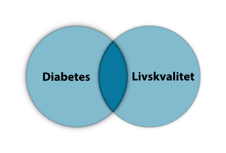
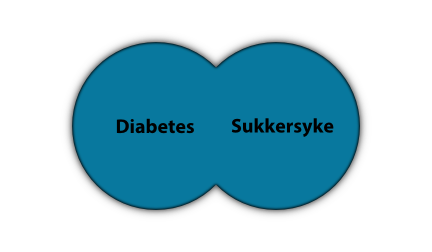
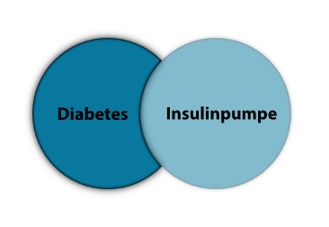

# Kombinasjon av søkeord

Når du har kommet fram til en tydelig problemstilling og funnet relevante søkeord, må du tenke gjennom hvordan disse skal kombineres. I de fleste databaser kan du kombinere søkeord på tre forskjellige måter: med AND, OR eller NOT (disse tre kalles Boolske operatorer).

## Kombinasjon med AND

Dersom du velger å kombinere to søkeord med AND, får du bare treff på litteratur som omhandler begge ordene. Kombinasjoner med AND spisser søket, og de er med på å snevre inn antall treff.

Søk på **Diabetes AND Livskvalitet** gir bare treff på litteratur som handler om **både** diabetes og livskvalitet.

## Kombinasjon med OR

Dersom du velger å kombinere to søkeord med OR, får du treff som inneholder det ene, det andre eller begge ordene. Kombinasjoner med OR utvider søket og gir deg **flere** treff. OR brukes som regel ved synonyme søkeord.

Søk på **Diabetes OR Sukkersyke** gir treff på diabetes, sukkersyke eller begge deler.

## Kombinasjon med NOT

Dersom du velger å kombinere to søkeord med NOT, får du treff på det ene ordet mens du utelater det som også handler om det andre søkeordet. Kombinasjoner med NOT kan utelate svært mange treff, så de bør brukes med varsomhet.

Søk på **Diabetes NOT Insulinpumpe** gir treff på diabetes mens det utelater alt som i tillegg handler om insulinpumpe.

