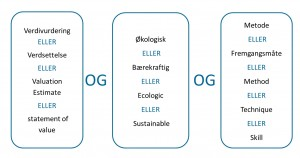

# Søketeknikker

Det første du må gjøre, er å finne gode søkeord. Bruk problemstillingen som utgangspunkt og identifiser sentrale begreper, inkludert alternative termer (synonymer).

**Tenk på følgende**

- Bruk fagterminologi. Mange databaser har en innebygd emneordsliste (tesaurus) over anerkjente fagtermer med tilhørende synonymer.
- Vær oppmerksom på at søkeord som er gode i én database, kan være mindre gode i en annen.
- Språk: De fleste internasjonale databaser krever at du søker på engelsk. Selv om [Oria](http://oria.no) gir treff både på norsk og engelsk, kan du gå glipp av svært mange aktuelle dokumenter dersom du bare velger norske søkeord. Engelske fagtermer kan finnes i lærebøker, fagartikler og ordbøker. Les sammendrag og sjekk forfatternes egne emneord.
- Vær kreativ: Finn flest mulig synonymer som er dekkende for innholdet i begrepene du er interessert i.
- Sett opp en tabell med kolonner for hvert begrep i problemstillingen, og føy til synonymer underveis (se eksempel lenger ned).
- Ikke bruk for mange ulike søkeord - to til tre er vanligvis nok.

## Fritekstsøk

Fritekstsøk, eller søk på tekstord, er den vanligste måten å søke på. Da søker du på ord i tittel, sammendrag, emne- og nøkkelord. Siden samme fenomen ofte dekkes av forskjellige termer, er det viktig å søke på synonymer.

## Avgrensing av søk

Benytt databasenes muligheter for å avgrense/snevre inn en lang treffliste. I de fleste databaser kan du avgrense på publiseringsår, språk, større emneområder og dokumenttyper. Vær obs på at enhver avgrensing kan føre til at du mister viktig informasjon.

<Video id="\_yKr4R3k5Pg" />

## Emneordssøk

Å søke på emneord vil si å søke via emneordslistene i databasen. Da søker du på standardiserte emneord som beskriver innholdet i et dokument. En fordel med søk på emneord, er at det automatisk inkluderer søk på synonyme termer.

<Video id="V20SCScsECE" />

## Kombiner søkeord

Når du har funnet alle relevante søkeord, må du tenke gjennom hvordan de skal kombineres. I de fleste databaser kan du kombinere søkeord på tre forskjellige måter: med OG/AND, ELLER/OR, IKKE/NOT. Dette kalles å søke med boolske operatorer.

### Kombinasjon med AND

Dersom du velger å kombinere to søkeord med AND, får du bare treff på litteratur som omhandler begge ordene. Kombinasjoner med AND spisser søket, og bidrar til å **begrense** antall treff.

Eksempel: Søk på **Diabetes AND Livskvalitet** gir bare treff på litteratur som handler om **både** diabetes og livskvalitet.

<ClientOnly>
  <Venn 
    v-bind:sets="[
        {sets: ['Diabetes'], size: 12}, 
        {sets: ['Livskvalitet'], size: 12},
        {sets: ['Diabetes','Livskvalitet'], size: 3}
    ]" 
    text="Treff for AND-søk"
    type="and" />
</ClientOnly>

### Kombinasjon med OR

Dersom du velger å kombinere to søkeord med OR, får du treff som inneholder det ene, det andre eller begge ordene. Kombinasjoner med OR utvider søket og gir deg **flere** treff. OR brukes som regel ved synonyme søkeord.

Eksempel: Søk på **Diabetes OR Sukkersyke** gir treff på diabetes, sukkersyke eller begge deler.

<ClientOnly>
  <Venn 
    v-bind:sets="[
        {sets: ['Diabetes'], size: 12}, 
        {sets: ['Sukkersyke'], size: 12},
        {sets: ['Diabetes','Sukkersyke'], size: 3}
    ]" 
    text="Treff for OR-søk"
    type="or" />
</ClientOnly>

### Kombinasjon med NOT

Dersom du velger å kombinere to søkeord med NOT, får du treff på det ene ordet mens du utelater det som også handler om det andre søkeordet. Kombinasjoner med NOT kan utelate svært mange treff, så de bør brukes med varsomhet.

Eksempel: Søk på **Diabetes NOT Insulinpumpe** gir treff på diabetes mens det utelater alt som i tillegg handler om insulinpumpe.

<ClientOnly>
  <Venn 
    v-bind:sets="[
        {sets: ['Diabetes'], size: 12}, 
        {sets: ['Insulinpumpe'], size: 12},
        {sets: ['Diabetes','Insulinpumpe'], size: 3}
    ]" 
    text="Treff for NOT-søk"
    type="not" />
</ClientOnly>

## Bruk av søketabell

Tabellen nedenfor har tre kolonner, en for hvert av de tre begrepene i problemstillingen. Først kombineres de synonyme søkeordene i hver kolonne med ELLER, så kombineres alle treffene i de tre kolonnene med OG.

Denne framgangsmåten kan brukes på de aller fleste prosjekter.

Problemstilling: "Lønner det seg for bedrifter å markedsføre seg som bærekraftig?" 

:::: søketabell 

::: tabell
Verdivudering

**OR**

Verdisettelse

**OR**

Valuation estimate

**OR** 

Statement of value
:::

::: kombinator
**AND**
:::

::: tabell
Økologisk

**OR**

Bærekraftig

**OR**

Ecologic

**OR**

Sustainable
:::

::: kombinator
**AND**
:::

::: tabell
Metode

**OR**

Fremgangsmåte

**OR**

Method

**OR**

Technique

**OR**

Skill
:::

::::

## Generelle søketips

Ulike databaser krever ulike måter å søke på. Søkefasilitetene i databasen hjelper deg å løfte fram relevant litteratur og å unngå lange trefflister med irrelevante dokumenter. En gjennomgang av databasens hjelpeside kan derfor spare mye tid.

### Trunkering

Ved trunkering søker du på stammen av et ord for å få med både entalls- og flertallsformer og ulike varianter av ordet. Trunkering **øker** antall treff. Som regel er trunkeringstegnet en stjerne (\*). Trunkering bør benyttes med omtanke; dersom du trunkerer for tidlig i ordet, kan du få lange trefflister med uaktuell litteratur. Skal du for eksempel lese om «engler» og trunkerer til eng\* for å få med entallsformen «engel», vil du drukne i treff på ord som **eng**asjement, **Eng**land, **eng**elsk osv.

### Lagring av søk

De fleste databaser gir deg mulighet til å lagre søket eller sende søkehistorikken via e-post. Søkehistorikken viser hvilken database du har søkt i, hvilke søkeord du har brukt, hvordan søkeordene er kombinert og hvor mange treff du har fått. Dette kan være svært nyttig informasjon å ta vare på hvis du for eksempel ønsker å bygge videre på søket, eller hvis du ønsker å foreta det samme søket i en annen database.

### Siteringssøk

Noen databaser og verktøy som Web of Science og Google Scholar gir informasjon om hvor ofte et dokument er sitert og hvem som har gjort det. Hvor ofte et dokument er sitert, kan si kan si noe om hvor stor gjennomslagskraft dokumentet har hatt på fagområdet. Klikker du på lenken «Cited by» i Google Scholar, får du opp en liste med siteringer. En slik liste kan løfte fram sentrale dokumenter og nøkkelforfattere.

### Søk i referanselister

Det er ikke bare ved å foreta søk i databaser du finner god og kvalitetssikret informasjon. Hvis du har funnet en vitenskapelig artikkel som er midt i blinken for din oppgave, kan artikkelens referanseliste vise til aktuell litteratur som du kan bruke.
