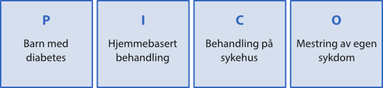
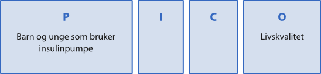
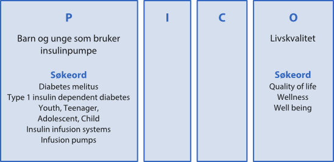

I en del fag forventes det at du lærer deg å gjøre systematiske søk etter forskningsresultater. Dette gjelder fag som er opptatt av kunnskapsbasert praksis, som sykepleie, medisin, psykologi og til dels pedagogikk. Når du foretar et systematisk søk, skal søket være planmessig gjennomført, godt dokumentert, og det skal være etterprøvbart.

## Problemstilling

Før du kan foreta et systematisk søk, må du [arbeide grundig med problemstillingen](/skriving/struktur-og-argumentasjon/oppbygning-av-en-oppgave/#Avgrensning_og_problemstilling "Oppbygning av en oppgave"). Det er viktig å finne ut hva slags informasjon du er ute etter å finne. Ofte kan det være nyttig å formulere problemstillingen som et spørsmål. I denne fasen kan PICO-skjemaet være et hjelpemiddel til å strukturere spørsmålet og å skille ut de viktigste begrepene i problemstillingen slik at overgangen til søk blir enklere.

PICO står for bestemte elementer som ofte er med i en helsefaglig problemstilling:

****P****: (problem/patient): pasient/pasientgruppe/diagnose  
**I**: (intervention): tiltak /eksponering  
**C**: (comparison): eventuell sammenligning med et annet tiltak/eksponering  
**O**: (outcome): utfall (det du vil ha ny kunnskap om)

Foreløpig er PICO-skjemaet mest brukt innen helsefag. PICO klargjør hvem/hva problemstillingen din handler om, hvilke tiltak som skal undersøkes og hvilke utfall du er interessert i.

EKSEMPEL: Anvendelse av PICO på to helsefaglige spørsmål

Spørsmål 1: _Vil barn med diabetes mestre sin sykdom bedre dersom de blir behandlet av spesialister i sitt eget hjem enn om behandlingen foregår på sykehus?_

I dette eksempelet er vi interessert i effekten av tiltaket «hjemmebasert behandling» (**I**) sett i forhold til effekten av «behandling på sykehus» (**C**). Det vil si at vi ønsker å finne studier som sammenligner disse to tiltakene. Det vi ønsker å måle (**O**), er pasientgruppens mestring av sin sykdom.

Det er ikke alltid hensiktsmessig å fylle ut alle fire elementene i PICO-skjemaet. Noen ganger har man ingen klar **I** (intervensjon), andre ganger mangler **C** (sammenligning) og andre ganger finnes ingen tydelig formulert **O** (utfall). Spørsmål 2 nedenfor er et eksempel på at vi kun har definert **P** og **O**.

Spørsmål 2: _Hvordan oppleves livskvaliteten til barn og unge som bruker insulinpumpe?_

I dette eksempelet har vi tatt utgangspunkt i den samme pasientgruppen som i spørsmål 1, men pasientgruppen er spisset til kun å gjelde de barna med diabetes som allerede bruker insulinpumpe. Det er ikke definert spesielle tiltak som vi er interessert i å se effekten av, derfor har vi ikke notert noe under hverken **I** eller **C**. Det vi ønsker å få mer kunnskap om (**O**), er pasientenes egne opplevelser av sin situasjon.

## Søkeord

Når du har skilt ut de viktigste elementene i problemstillingen via for eksempel PICO-skjemaet, må du jobbe videre med å finne presise fagtermer og synonymer som du kan bruke i litteratursøket.

I de fleste basene kreves det at du bruker engelske søketermer. Hjelp til dette, finner du for eksempel i:

- Wikipedia
- Ordbøker
- Emneordslister i databasene.

Innen helsefag er Medical Subject Headings (MeSH) den mest kjente emneordslisten. Den brukes i flere helsefaglige databaser.

For å være sikker på å finne alle relevante artikler, bør man søke på synonyme termer. Velger du å søke via emneordslisten i en av databasene (for eksempel MeSH), vil den automatisk inkludere en del synonymer i søket. Likevel er det nyttig å supplere med søk på tekstord som hentes fra forfatters emneord og sammendraget av artikkelen.

EKSEMPEL: PICO-skjema med forslag til synonymer

Nedenfor vises et utfylt PICO-skjema med forslag til synonymer til spørsmål 2: _Hvordan oppleves livskvaliteten til barn og unge som bruker insulinpumpe?_

## Kombinasjon av søkeord

Alle store artikkeldatabaser gir deg tilgang til en søkehistorikk. Søkehistorikken viser hvilke emneord og tekstord du har søkt på, hvordan de er kombinert og hvor mange treff hvert søk har gitt. Søkeprosessen blir fleksibel og tydelig dersom du velger å søke på ett og ett ord av gangen for så å [kombinere søkene](/soking/utdypende-sok/kombinasjon-av-sokeord/ "Kombinasjon av søkeord") med AND, OR eller NOT i søkehistorikken.

::: details EKSEMPEL: Systematisk søk presentert via søkehistorikken.
Her presenteres søkehistorikken til et søk på spørsmål 2: _Hvordan oppleves livskvaliteten til barn og unge som bruker insulinpumpe?_

Søket er tatt i databasen Medline-Ovid 1996 og opp til i dag. Dato for søket: 04.04.14

| #        | Searches                                          | Results |
|----------|---------------------------------------------------|---------|
| 1        | exp Diabetes Mellitus, Type 1/                    | 35330   |
| 2        | (insulin adj dependent).tw.                       | 10687   |
| 3        | 1 or 2                                            | 41759   |
| 4        | (youth or teenager* or adolescent* or child*).tw. | 591106  |
| 5        | exp Adolescent/                                   | 821820  |
| 6        | exp Child/                                        | 721155  |
| 7        | 4 or 5 or 6                                       | 1307311 |
| 8        | exp «Quality of Life»/                            | 98652   |
| 9        | (quality adj2 life).tw.                           | 118348  |
| 10       | (life adj quality).tw.                            | 2843    |
| 11       | (well adj being).tw.                              | 28740   |
| 12       | Wellness.tw.                                      | 3183    |
| 13       | 8 or 9 or 10 or 11 or 12                          | 174420  |
| 14       | exp Insulin Infusion Systems/                     | 1794    |
| 15       | (infusion adj pump*).tw.                          | 1266    |
| 16       | exp Infusion Pumps/                               | 6397    |
| 17       | 14 or 15 or 16                                    | 7034    |
| 18       | 3 and 7 and 13 and 17                             | 100     |

Forklaringer til søkehistorikken:

- / : skråstreken viser at søketermen er hentet fra emneordslisten Medical Subject Headings (MeSH)
- exp: explode viser at underordnede termer er tatt med
- tw : viser at dette er et søk på tekstord (text word) som hentes fra tittel eller sammendrag av artikkelen (ikke fra MeSH)
- adj: søketermene skal opptre som en frase, det vil si rett etter hverandre og i gitt rekkefølge
:::

## Gjennomgang av søkeresultatet

En gjennomgang av trefflisten kan av og til gi ny innsikt som igjen fører til at du ønsker å endre den opprinnelige problemstillingen. På samme måte kan en svært lang treffliste synliggjøre at problemstillingen er for vid og at den bør spisses/gjøres mer presis. I slike tilfelle må søkestrategien settes opp på nytt, og søket justeres i henhold til den nye problemstillingen. I eksempelet over, viste gjennomgangen av trefflisten at det er stor forskjell på hvordan barn og ungdom opplever det å leve med insulinpumpe. Muligens ville det være lurt å snevre inn problemstillingen slik at den kun omhandler enten barn eller ungdom. Eventuelt kunne gjennomgangen føre til at du ønsket å dreie problemstillingen mot hvorfor bruk av insulinpumpe oppleves så forskjellig for de to aldersgruppene.

De enkelte databasene tilbyr også muligheter for å avgrense/snevre inn en treffliste. Du kan for eksempel avgrense på:

- årstall
- publikasjonstype (forskningsartikler eller forskningstidsskrifter)
- språk
- forskningsmetode
- tilgjengelighet (for eksempel fulltekst)

Husk at enhver avgrensing kan føre til at du går glipp av sentral informasjon.

Til slutt må du [vurdere](/kildebruk-og-referanser/kildevurdering/ "Kildevurdering") den enkelte artikkels [kvalitet](/kildebruk-og-referanser/kildevurdering/kvalitative-vurderinger/ "Kvalitative vurderinger") og [relevans](/kildebruk-og-referanser/kildevurdering/vurdering-av-relevans/ "Vurdering av relevans") i forhold til problemstillingen din.

## Dokumenter søket

I enkelte fag må du, etter å ha avsluttet det systematiske søket, beskrive selve søkeprosessen grundig slik at leseren er i stand til å evaluere kvaliteten på søket du har gjort, og eventuelt kunne gjenta det samme søket senere. Du bør si noe om:

- hvilke databaser du har valgt å søke i
- hvilke søketermer du har brukt i de forskjellige databasene og hvordan de er kombinert (AND/OR/NOT)
- har du utnyttet databasens emneordsliste?
- har du utnyttet andre søkefasiliteter i databasen?
- dato for når søket ble tatt

**TIPS**: når du er ferdig med et søk i en database, er det lurt å lagre søkehistorikken slik at du kan hente den fram igjen seinere. Søkehistorikken er den beste dokumentasjonen på søket ditt. Husk å notere ned hvilken database du har søkt i.

**Videre lesing:  
**Haraldstad, A.-M.B. og Christophersen, E. (2008) Litteratursøk og personlige referansedatabaser. I: Laake, P., Olsen, B.R. og Benestad, H.B. red. _Forskning i medisin og biofag._ 2. utg. Oslo, Gyldendal akademisk, s.147-186.

Se også PhD on track om [søking for systematiske oversikter. ](http://www.phdontrack.net/review-and-discover/systematic-review-searching/)
